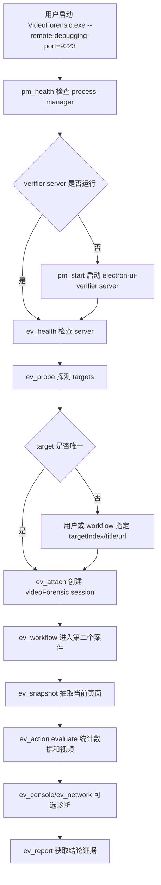
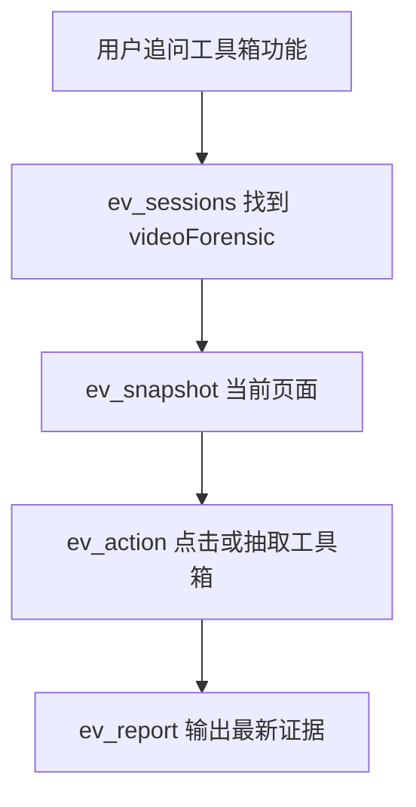

# 执行计划（Execution Plan）

## 问题定义（Problem）

目标（Goal）:

- 将 `electron-ui-verifier` 从当前 one-shot runner 彻底重构为 server-only 形态。
- 后续所有 Electron UI 验证、点击、截图、DOM/文本/表格抽取、console/异常/network 诊断、DOMSnapshot、accessibility 和 evaluate 都通过常驻 verifier server 完成。
- verifier server 本身作为长期后台服务进程，由 `process-manager` skill 管理生命周期。
- 参考 `process-manager` 的设计理念：常驻 Python 服务、状态落盘、多个小入口脚本封装 API、agent 不直接手写 HTTP 请求。

明确决策（Decision）:

- 不再保留“双模式”作为推荐使用方式。
- `electron_verify.py run/probe/snapshot/screenshot` 的 one-shot 使用路径需要被替换或废弃。
- `electron_verify.py` 在实现阶段删除，不保留废弃提示入口。
- 允许把可复用逻辑迁移到新模块，但用户可见调用入口必须转为 server + `ev_*` 脚本。
- verifier server 的 Python 解释器优先从 electron verifier 自己的环境文件读取；如果缺失或不确定，由用户口头指定后持久化写入该环境文件。
- 采用分阶段提交，每个阶段完成审查和验证后提交。

非目标（Non-goals）:

- 不用 `process-manager` 托管 Electron GUI 应用本体。Electron GUI 仍由用户或普通终端命令启动。
- 不把 process-manager 的代码复制进 electron skill；只复用它作为后台服务进程管理工具。
- 不引入 Appium、WinAppDriver 或非 Electron 原生窗口自动化。
- 不在本阶段实现代码；当前只落盘详尽重构方案。

验收标准（Acceptance）:

- 规划必须讲清楚 server-only 最终结构、脚本入口、server API、状态文件、artifact 策略和 process-manager 托管方式。
- 规划必须说明从当前 one-shot runner 到 server-only 的迁移路径，避免使用时仍然调用旧 `electron_verify.py run`。
- 规划必须覆盖 VideoForensic 这类连续 UI 分析流程。
- 规划必须包含分阶段实现、验证策略、回滚策略、风险和需用户确认项。

## 当前上下文（Current Context）

当前 `electron-ui-verifier` 文件:

- `SKILL.md`
- `agents/openai.yaml`
- `scripts/electron_verify.py`
- `references/actions.md`
- `references/workflow.md`
- `references/troubleshooting.md`
- `assets/workflow.example.json`
- `assets/diagnostics.workflow.example.json`

当前能力:

- `electron_verify.py` 是一次性 CLI runner。
- 每次 `run` 会读取 workflow、选择 target、建立 CDP WebSocket、执行 steps、写 report 后断开。
- 同一个 workflow 内不会每步重连，但多轮追问会重新执行脚本并重新 attach CDP。
- 近期已实现 CDP 事件缓冲、console/exception/network/DOMSnapshot/accessibility/evaluate 增强。

当前限制:

- 没有持久 session。
- 无统一 server 状态、session 列表、当前页面上下文、最近报告索引。
- 多个动作入口都需要构造 workflow 或调用 one-shot 子命令。
- 对连续 UI 分析不够自然，尤其是“进入案件后继续多轮询问”的场景。

process-manager 参考点:

- 使用常驻 Python manager。
- 通过小脚本调用 API，不要求 agent 直接写 HTTP 请求。
- runtime 状态落盘在 `.harness/process-manager/`。
- 服务配置必须用绝对路径。
- 后台进程窗口隐藏，stdout/stderr 由 manager 管理。
- readiness 必须明确，不能只认为进程存活就是业务 ready。

## 总体方向（Direction）

server-only 最终形态:

```text
Electron GUI App
  由用户或普通终端启动，带 --remote-debugging-port

process-manager
  托管 electron verifier server 后台进程

electron verifier server
  维护 CDP sessions、targets、events、artifacts、reports

ev_* scripts
  封装 server API，供 agent 调用
```

调用原则:

- agent 不直接调用 verifier server HTTP API。
- agent 只调用 `scripts/ev_*.py` 小入口脚本。
- `ev_*` 脚本必须输出 JSON，便于 agent 稳定解析。
- Electron GUI 本体不由 process-manager 管理；只有 verifier server 由 process-manager 管理。

## 推荐仓库结构（Proposed Structure）

```text
skills/electron-ui-verifier/
├── SKILL.md
├── agents/
│   └── openai.yaml
├── assets/
│   ├── workflow.example.json
│   └── diagnostics.workflow.example.json
├── references/
│   ├── actions.md
│   ├── server.md
│   ├── troubleshooting.md
│   └── workflow.md
├── scripts/
│   ├── ev_common.py
│   ├── ev_server.py
│   ├── ev_init.py
│   ├── ev_health.py
│   ├── ev_attach.py
│   ├── ev_detach.py
│   ├── ev_sessions.py
│   ├── ev_probe.py
│   ├── ev_action.py
│   ├── ev_workflow.py
│   ├── ev_snapshot.py
│   ├── ev_screenshot.py
│   ├── ev_console.py
│   ├── ev_exceptions.py
│   ├── ev_network.py
│   ├── ev_report.py
│   └── ev_doctor.py
└── templates/
    └── process-manager-service.json
```

旧文件处理:

- `scripts/electron_verify.py` 不再作为用户入口。
- 实现阶段优先把可复用逻辑迁移到 `ev_common.py` 或 `ev_server.py`。
- 迁移完成后删除 `scripts/electron_verify.py`。
- 文档、示例和测试中不得继续出现 `electron_verify.py run/probe/snapshot/screenshot` 作为调用方式。

新增引用文档:

- `references/server.md`: server 生命周期、process-manager 托管、session 概念、状态目录、脚本调用顺序。
- `references/actions.md`: 继续描述 action schema，但改成 server 执行语义。
- `references/workflow.md`: 从 “run one-shot workflow” 改为 “server session 内执行 workflow”。
- `references/troubleshooting.md`: 增加 server 离线、session 断开、CDP target 失效、process-manager readiness 失败等排障。

## Runtime 状态设计（Runtime State）

verifier server runtime 根目录:

```text
.harness/electron-ui-verifier/
├── config.json
├── token
├── server.json
├── sessions.json
├── reports/
├── artifacts/
├── logs/
└── tmp/
```

说明:

- `.harness/electron-ui-verifier/` 是运行产物目录，默认应加入 `.gitignore`。
- `config.json` 描述 verifier server 控制面，不描述 Electron GUI 应用。
- `token` 用于本地 API 鉴权，脚本读取但不打印。
- `server.json` 记录 server host、port、pid、startedAt、process-manager service 名称。
- `sessions.json` 记录已 attach 的 Electron CDP session 摘要。
- `reports/` 保存每次 workflow/action 生成的结构化报告。
- `artifacts/` 保存截图、snapshot、console、network、DOMSnapshot、accessibility 等产物。

server 配置:

```json
{
  "host": "127.0.0.1",
  "port": 18180,
  "portRetry": {
    "enabled": true,
    "maxSwitches": 3
  },
  "workspaceRoot": "E:/work/hl/videoForensic/AI/dev-skills",
  "stateRoot": "E:/work/hl/videoForensic/AI/dev-skills/.harness/electron-ui-verifier",
  "tokenFile": "E:/work/hl/videoForensic/AI/dev-skills/.harness/electron-ui-verifier/token"
}
```

规则:

- host 只能是 `127.0.0.1`。
- port 默认建议 `18180`，避免和 process-manager 默认 `18080` 冲突。
- 支持端口失败后最多递增重试 3 次，并把实际端口写回 `config.json`。
- 所有路径必须是绝对路径。

环境文件:

```text
.harness/electron-ui-verifier/environment.json
```

用途:

- 保存 verifier server 自己需要的本机运行环境。
- 包含 Python 解释器绝对路径、workspaceRoot、默认 server port 和初始化时间。
- 由 `ev_init.py` 创建或更新。
- 如果用户在会话中口头指定 Python 解释器，agent 必须把该路径写入此文件，后续启动严格读取该文件。

示例:

```json
{
  "python": "F:/env/anaconda/python.exe",
  "workspaceRoot": "E:/work/hl/videoForensic/AI/dev-skills",
  "server": {
    "host": "127.0.0.1",
    "port": 18180
  }
}
```

环境规则:

- `python` 必须是绝对路径，并且存在。
- 如果 `environment.json` 不存在，实施时先用当前 `sys.executable` 生成；若该路径不确定或不可用，暂停询问用户。
- 如果用户口头指定新解释器，必须立即更新 `environment.json`，不能只写在对话里。
- process-manager service JSON 从 `environment.json` 派生，不手写散落的 Python 路径。

session 记录:

```json
{
  "name": "videoForensic",
  "sessionId": "ev-20260701-120000-a1b2c3",
  "cdp": "http://127.0.0.1:9223",
  "targetId": "page-target-id",
  "targetTitle": "VideoForensic",
  "targetUrl": "app://index.html",
  "status": "attached",
  "createdAt": "2026-07-01T12:00:00Z",
  "lastUsedAt": "2026-07-01T12:05:00Z",
  "eventCounts": {}
}
```

session 规则:

- `name` 由用户或 agent 指定，建议稳定短名，例如 `videoForensic`。
- 同名 session 默认复用；如 target 已失效则返回明确错误，要求重新 attach。
- session 保存 CDP WebSocket 连接和 event buffer。
- server 进程退出后 session 失效；重启 server 后需要重新 attach。

## Process Manager 托管方式（Process Manager Integration）

verifier server 是长期后台服务，必须由 `process-manager` 管理。

初始化顺序:

1. 使用 `process-manager` 的 `pm_health.py` 检查 manager 是否在线。
2. 如果离线，按 process-manager 规则请求用户启动或批准 `start_manager.ps1`。
3. 使用 `ev_init.py` 生成 `.harness/electron-ui-verifier/config.json` 和 process-manager service JSON。
4. 使用 `pm_validate.py --service <service-json>` 验证 service。
5. 使用 `pm_start.py --service <service-json>` 启动 verifier server。
6. 使用 `pm_ready.py --service electron-ui-verifier` 等待 readiness。
7. 使用 `ev_health.py` 检查 verifier server 自身健康。

process-manager service 模板:

```json
{
  "name": "electron-ui-verifier",
  "kind": "long-running",
  "cwd": "E:/work/hl/videoForensic/AI/dev-skills",
  "launcher": {
    "type": "direct",
    "argv": [
      "F:/env/anaconda/python.exe",
      "E:/work/hl/videoForensic/AI/dev-skills/skills/electron-ui-verifier/scripts/ev_server.py",
      "--config",
      "E:/work/hl/videoForensic/AI/dev-skills/.harness/electron-ui-verifier/config.json"
    ]
  },
  "readiness": {
    "type": "http",
    "url": "http://127.0.0.1:18180/health",
    "timeoutSeconds": 30
  }
}
```

注意:

- service 中的 Python 路径必须来自用户环境或当前可用 Python 的绝对路径。
- 如果用户使用 conda/venv，需要在初始化前确认 Python 解释器路径。
- 不使用 `powershell -Command` 或任意 shell command。
- 不把带机器绝对路径的 service JSON 提交到仓库，除非用户明确要求。

## Server API 设计（Internal API）

API 只供 `ev_*` 脚本调用，agent 不直接写 HTTP 请求。

基础:

- `GET /health`
- `GET /sessions`
- `POST /sessions/attach`
- `POST /sessions/detach`
- `GET /sessions/status`

操作:

- `POST /actions/run`
- `POST /workflows/run`
- `POST /targets/probe`

报告:

- `GET /reports/latest`
- `GET /reports/get`
- `GET /artifacts/get`

请求约定:

- 所有请求必须带 bearer token。
- 请求体必须是 JSON object。
- `session` 或 `sessionId` 必须明确。
- 不允许远程 CDP，除非 workflow 或 attach 参数显式 `allowRemoteCdp: true`。

响应约定:

```json
{
  "ok": true,
  "result": {},
  "report": "absolute/path/to/report.json",
  "artifacts": []
}
```

错误响应:

```json
{
  "ok": false,
  "error": "可读错误",
  "code": "target_ambiguous"
}
```

必须保留的错误码:

- `server_not_ready`
- `session_not_found`
- `session_disconnected`
- `target_ambiguous`
- `target_not_found`
- `cdp_unavailable`
- `action_failed`
- `workflow_failed`
- `method_unsupported`
- `artifact_too_large`

## 脚本入口设计（Scripts）

所有脚本必须:

- 输出 JSON。
- 使用绝对路径参数。
- 从 `.harness/electron-ui-verifier/config.json` 读取 server endpoint 和 token。
- 不直接操作 CDP，除 `ev_server.py` 内部。
- 不绕过 process-manager 启停 server。

推荐入口:

```text
ev_init.py        初始化 verifier runtime 和 process-manager service 模板
ev_health.py      检查 verifier server 健康
ev_probe.py       通过 server 探测 CDP targets
ev_attach.py      attach 到 Electron CDP target，创建/复用 session
ev_detach.py      断开 session
ev_sessions.py    列出 sessions
ev_action.py      执行单个 action JSON
ev_workflow.py    在 session 内执行 workflow JSON
ev_snapshot.py    快速 snapshot 当前 session
ev_screenshot.py  快速截图当前 session
ev_console.py     导出 console
ev_exceptions.py  导出 exceptions
ev_network.py     导出 network
ev_report.py      查看最新报告或指定报告
ev_doctor.py      检查配置、process-manager、server、session 和 CDP 常见问题
```

示例调用:

```powershell
python skills/process-manager/scripts/pm_health.py
python skills/electron-ui-verifier/scripts/ev_init.py --python F:/env/anaconda/python.exe --workspace E:/work/hl/videoForensic/AI/dev-skills
python skills/process-manager/scripts/pm_validate.py --service E:/work/hl/videoForensic/AI/dev-skills/.harness/process-manager/services/electron-ui-verifier.json
python skills/process-manager/scripts/pm_start.py --service E:/work/hl/videoForensic/AI/dev-skills/.harness/process-manager/services/electron-ui-verifier.json
python skills/process-manager/scripts/pm_ready.py --service electron-ui-verifier
python skills/electron-ui-verifier/scripts/ev_health.py
```

VideoForensic 连续分析:

```powershell
python skills/electron-ui-verifier/scripts/ev_probe.py --cdp http://127.0.0.1:9223
python skills/electron-ui-verifier/scripts/ev_attach.py --name videoForensic --cdp http://127.0.0.1:9223 --target-index 0
python skills/electron-ui-verifier/scripts/ev_workflow.py --session videoForensic --workflow E:/work/.../open-second-case.workflow.json
python skills/electron-ui-verifier/scripts/ev_snapshot.py --session videoForensic
python skills/electron-ui-verifier/scripts/ev_action.py --session videoForensic --action E:/work/.../count-video.action.json
python skills/electron-ui-verifier/scripts/ev_report.py --session videoForensic --latest
```

## Action 执行语义（Action Semantics）

server-only 后的 action 不再每次新建 CDP 连接。

语义:

- `ev_attach.py` 创建 session 时建立 CDP WebSocket。
- session 保持 `Runtime.enable`、`Page.enable`。
- 如果 workflow 或 action 需要 network，server 对该 session 启用 `Network.enable`。
- `collectConsole`、`collectExceptions`、`collectNetwork` 从 session event buffer 读取。
- `domSnapshot`、`accessibilitySnapshot` 在 session 当前 target 上即时调用。
- `evaluate` 在 session 当前 target 上执行，结果写入 report `namedResults`。
- `clickText`、`fillText`、`pressKey` 等会改变当前页面状态，后续 action 继续基于同一 session 页面。

report 语义:

- 每次 action/workflow 都生成 report。
- report 记录 sessionId、sessionName、target metadata、steps、artifacts、diagnostics、namedResults。
- session 保留 `latestReport`，便于 `ev_report.py --latest` 获取。

## VideoForensic 流程图（Example Flow）



连续追问:



优势:

- 不再每次 workflow 重新 attach。
- 多轮追问复用同一页面状态和 event buffer。
- agent 只调用小脚本，不直接拼 server API。
- server 作为后台服务由 process-manager 管理，不阻塞主工作 shell。

## 迁移策略（Migration Strategy）

原则:

- 实现阶段必须一次性切到 server-only 使用路径。
- 文档和示例不能继续推荐 `electron_verify.py run`。
- `electron_verify.py` 必须删除，不保留废弃提示入口。

迁移步骤:

1. 抽出 `electron_verify.py` 中可复用的 CDP、target、action、report 逻辑。
2. 建立 `ev_server.py`，持有 session 和 CDP client。
3. 建立 `ev_common.py`，提供配置、token、HTTP client、JSON 输出、路径校验。
4. 建立 `ev_*` 小入口脚本。
5. 改写 `SKILL.md` 和 references，删除 one-shot runner 指南。
6. 改写 examples，所有模板以 session/server 为入口。
7. 删除 `electron_verify.py`，避免 agent 继续误用 one-shot CLI。

## 实施阶段（Implementation Plan）

### Stage 1：规划审批

目标:

- 完成本 server-only 重构方案，等待用户确认后再改代码。

验证:

- 完整复读本计划。
- active-task 指向本任务。
- 用户已确认：Python 解释器写入 electron verifier 自己的环境文件；`electron_verify.py` 删除；分阶段提交；允许 VideoForensic smoke。

### Stage 2：server 基础设施

目标:

- 实现 `ev_common.py`、`ev_server.py`、`ev_init.py`、`ev_health.py`。

工作:

- `ev_init.py` 读取或创建 `.harness/electron-ui-verifier/environment.json`。
- Python 解释器路径来自该环境文件；如果用户口头指定，必须持久化写入。
- runtime config/token/stateRoot。
- 本地 HTTP server，host 仅 `127.0.0.1`。
- bearer token 鉴权。
- port retry。
- `/health`。
- process-manager service 模板生成。

验证:

- `py_compile`。
- `ev_init.py` 生成配置。
- 用 process-manager 启动 server。
- `ev_health.py` 返回 ok。

完成记录:

- 已完成 `ev_common.py`、`ev_server.py`、`ev_init.py`、`ev_health.py`。
- 已将 verifier server Python 解释器写入 `.harness/electron-ui-verifier/environment.json`，该目录为本机运行产物，不提交。
- 已新增 `.harness/electron-ui-verifier/` git ignore，避免 token、绝对路径和运行状态进入仓库。
- 已修正 process-manager readiness 为 log readiness，server 绑定成功后输出 `EV_READY <health-url>`，避免端口重试后静态 health URL 失效。
- 验证通过：`py_compile`、`ev_init.py`、`pm_health.py`、`pm_validate.py`、`pm_start.py`、`pm_ready.py`、`ev_health.py`。
- Commit: `4c5a468`

### Stage 3：session 和 target 管理

目标:

- 实现 `ev_probe.py`、`ev_attach.py`、`ev_detach.py`、`ev_sessions.py`。

工作:

- `/targets/probe`。
- `/sessions/attach`。
- `/sessions/detach`。
- `/sessions`。
- server 内部维护 session name/id、target metadata、CDP websocket、event buffer。

验证:

- mock CDP endpoint。
- 多 target ambiguity 必须失败并给候选。
- 同名 session 复用。
- target 失效时返回 `session_disconnected`。

完成记录:

- 已实现 `ev_probe.py`、`ev_attach.py`、`ev_detach.py`、`ev_sessions.py`。
- 已补充 server `/sessions/status`，session 列表和状态检查均通过 server API。
- 已统一客户端脚本退出码，server 返回 `ok: false` 时 CLI 退出码为 2，避免自动化误判。
- 验证通过：`py_compile`、process-manager stop/start/ready、`ev_sessions.py`、`ev_health.py`、不可达 CDP probe 错误路径。
- 未做真实 CDP attach；真实 VideoForensic smoke 留到 Stage 8。
- Commit: `250c844`

### Stage 4：action server 化

目标:

- 把现有 action 能力迁移到 server session 内执行。

工作:

- `ev_action.py`。
- server `/actions/run`。
- snapshot、screenshot、clickText、clickXY、fillText、pressKey、extractText、extractTable、waitText、waitUrlContains。
- evaluate、collectConsole、collectExceptions、collectNetwork、domSnapshot、accessibilitySnapshot。

验证:

- mock session action 单测。
- 长结果 artifact。
- Network 在需要时启用且不重复启用。

完成记录:

- 已新增 `ev_action.py`，支持通过绝对 JSON 文件或 JSON 字符串执行单个 action。
- 已新增 `ev_snapshot.py`、`ev_screenshot.py`、`ev_console.py`、`ev_exceptions.py`、`ev_network.py` 和 `ev_report.py` 的基础入口。
- 已复用 server `/actions/run` 和 `/reports/latest`，快捷脚本不直接访问 CDP。
- 已修复 Windows UTF-8 BOM JSON 文件读取兼容性。
- 验证通过：全部 `ev_*.py` `py_compile`、缺失 session 错误路径、`ev_action.py` 绝对 JSON 文件读取。
- Commit: `9978beb`

### Stage 5：workflow server 化

目标:

- 实现 `ev_workflow.py` 和 server `/workflows/run`。

工作:

- workflow 在已有 session 中执行。
- readiness 和 steps 复用 action runner。
- 每次 workflow 产出 report。
- `continueOnFailure` 语义保留。

验证:

- 使用 mock workflow 跑完整流程。
- 旧 workflow 模板迁移后可执行。
- 失败 step 能停止后续必需 step。

完成记录:

- 已新增 `ev_workflow.py`，支持绝对 workflow JSON 文件或 JSON 字符串。
- 已通过 server `/workflows/run` 在已有 session 中执行 readiness 和 steps。
- 已增强 workflow 输入校验，readiness 和 steps 中的条目必须是 JSON object。
- 验证通过：`ev_workflow.py` 和 `ev_server.py` `py_compile`、缺失 session workflow 错误路径退出码 2。
- 真实 workflow 验证留到 Stage 8。
- Commit: `39e0394`

### Stage 6：报告、artifact 和快捷入口

目标:

- 完成 `ev_snapshot.py`、`ev_screenshot.py`、`ev_console.py`、`ev_exceptions.py`、`ev_network.py`、`ev_report.py`。

工作:

- 快捷脚本只是构造 action 并调用 server。
- report latest/get。
- artifact 索引和路径返回。

验证:

- 快捷脚本输出 JSON。
- latest report 能找到最后一次 action/workflow。
- artifact 存在且非空。

完成记录:

- 已补充 `/reports/get` 和 `/artifacts/get`，并限制只能读取 verifier stateRoot 下的文件。
- 已增强 `ev_report.py`，支持 `--latest --session` 和 `--path`。
- 已新增 `ev_artifact.py` 和 `ev_doctor.py`。
- 已验证 `ev_doctor.py`、process-manager ready、report/artifact stateRoot 外路径拒绝和非零退出码。
- Commit: `e4961d5`

### Stage 7：文档和废弃 one-shot

目标:

- 文档完全切换到 server-only。

工作:

- `SKILL.md` 改成必须先启动/检查 server。
- `references/server.md` 新增。
- `workflow.md` 改成 session workflow。
- `actions.md` 改成 server action。
- `troubleshooting.md` 增加 server/process-manager/session 排障。
- 删除 `electron_verify.py`。

验证:

- 搜索 `electron_verify.py run`、`snapshot --cdp` 等旧用法，确保不再推荐。
- skill metadata 仍符合 `skill-creator`。

完成记录:

- 已将 `SKILL.md` 改为 server-only 必须流程。
- 已新增 `references/server.md`，说明环境文件、process-manager 托管、session 和脚本顺序。
- 已更新 `workflow.md`、`actions.md`、`troubleshooting.md` 和 workflow 示例，移除旧 one-shot 连接语义。
- 已删除 `ev_server.py` 中旧 standalone `probe/run_workflow/one_shot` 函数。
- 验证通过：旧入口引用搜索无结果、全部 `ev_*.py` `py_compile`、示例 JSON 解析。
- Commit: `948b42a`

### Stage 8：真实和 mock 验证

目标:

- 确认 server-only 形态可用。

必需验证:

- `python -m py_compile skills/electron-ui-verifier/scripts/*.py`
- process-manager `pm_health.py`
- process-manager `pm_validate.py --service <electron-ui-verifier-service>`
- process-manager `pm_start.py`
- process-manager `pm_ready.py`
- `ev_health.py`
- mock CDP session attach/action/workflow/report。
- `ev_doctor.py`。

可选真实验证:

- 用户启动 `D:\VideoForensic\VideoForensic.exe --remote-debugging-port=9223`。
- `ev_probe.py`。
- `ev_attach.py --name videoForensic`。
- `ev_workflow.py` 进入第二个案件并统计。
- `ev_snapshot.py` / `ev_report.py`。

完成记录:

- 已完成 mock CDP 端到端验证：`ev_probe.py`、`ev_attach.py`、`ev_snapshot.py`、`ev_workflow.py`、`ev_report.py`、`ev_detach.py` 均通过。
- 已完成 verifier server `pm_ready.py` 和 `ev_doctor.py` 验证。
- 已完成全部 `ev_*.py` `py_compile`、示例 JSON 解析、旧入口引用搜索。
- 真实 VideoForensic smoke 未执行：`http://127.0.0.1:9223/json/version` 当前返回 503，说明测试时真实应用 endpoint 不可用。
- Commit: `fa4606f`

### Stage 9：最终审查和提交

目标:

- 审查 diff、验证记录、文档一致性，并按用户确认提交。

规则:

- 本任务采用分阶段提交。
- 每阶段提交前完成审查和验证。
- 提交使用 `git commit -F`，bullet 之间不空行。

完成记录:

- 已完成最终审查：旧入口搜索无结果、全部 `ev_*.py` 编译通过、分阶段提交记录已回填。
- 已停止验证期间启动的 `electron-ui-verifier` process-manager 服务。
- 已确认 `electron_verify.py` 已删除，最终入口为 server + `ev_*` 脚本。
- Commit: pending，最终提交后回填真实哈希。

## 风险和处理（Risks）

风险：server-only 重构范围大。

- 处理：分阶段迁移，先 server/session，再 action/workflow，再文档废弃旧入口。

风险：process-manager 未运行导致 verifier server 无法启动。

- 处理：严格按 process-manager workflow，先 `pm_health.py`，离线时请求用户启动或批准。

风险：server 崩溃导致 session 丢失。

- 处理：server 重启后返回 session 空状态，要求重新 attach；不伪装恢复旧 CDP websocket。

风险：runtime 目录带机器绝对路径。

- 处理：`.harness/electron-ui-verifier/` 和 process-manager service JSON 默认不提交。

风险：旧 `electron_verify.py` 被 agent 继续调用。

- 处理：文档不再引用；脚本删除或返回废弃提示；测试搜索旧调用。

风险：真实 Electron GUI 本体被错误托管。

- 处理：SKILL.md 硬规则强调只有 verifier server 用 process-manager；Electron GUI 本体仍普通启动。

## 待确认项（Pending Decisions）

用户已确认:

- D-001: verifier server 的 Python 解释器优先从 `.harness/electron-ui-verifier/environment.json` 读取；不确定时由用户口头指定，并立即持久化写入该文件。
- D-002: 删除 `electron_verify.py`，不保留废弃提示入口。
- D-003: 允许实现阶段使用 VideoForensic 做真实 smoke。
- D-004: 采用分阶段提交。

剩余阻塞项:

- 当前无阻塞项。

## 就绪门禁（Readiness Gate）

| 检查项 | 状态 | 说明 |
| --- | --- | --- |
| 目标明确 | pass | 用户明确要求彻底 server-only 重构 |
| process-manager 集成明确 | pass | verifier server 由 process-manager 管理 |
| Electron GUI 边界明确 | pass | GUI 本体不由 process-manager 管理 |
| 脚本入口明确 | pass | 使用 `ev_*` 小脚本 |
| runtime 状态明确 | pass | `.harness/electron-ui-verifier/` |
| 分阶段实现明确 | pass | Stage 2-9 |
| 当前是否允许实现 | approved | 用户已确认按方案实现 |

## 执行控制（Execution Control）

执行模式:

- run-to-completion

整体状态:

- complete

当前阶段:

- complete

剩余阶段:

- none

下一步:

- none

停止条件:

- complete

## 恢复摘要（Resume Summary）

- 当前任务：规划 `electron-ui-verifier` server-only 重构。
- 用户要求彻底重构，不要双模式。
- 最终形态：verifier server 常驻，`ev_*` 脚本封装 API，server 由 process-manager 托管。
- Electron GUI 本体仍不使用 process-manager。
- 用户已确认实现：Python 解释器写入 `.harness/electron-ui-verifier/environment.json`；删除 `electron_verify.py`；分阶段提交；允许 VideoForensic smoke。
- Stage 2 server 基础设施已完成并提交 `4c5a468`。
- Stage 3 session 和 target 管理已完成并提交 `250c844`。
- Stage 4 action server 化已完成并提交 `9978beb`。
- Stage 5 workflow server 化已完成并提交 `39e0394`。
- Stage 6 报告、artifact 和快捷入口已完成并提交 `e4961d5`。
- Stage 7 文档和废弃 one-shot 已完成并提交 `948b42a`。
- Stage 8 真实和 mock 验证已完成并提交 `fa4606f`。
- Stage 9 最终审查已完成，等待最终收口提交哈希回填。
